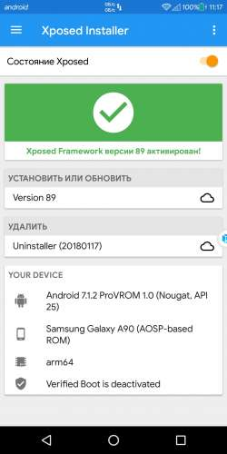

# proVROM
ROM вмещающий в себя все самые крутые вкусности и ништяки

<strong>📓 Функции и преимущества ROM</strong>

<ul>
 <li>Лишний софт удален</li>
 <li>Встроено много полезного софта</li>
 <li>ROOT , Xposed , Gapps , BusyBox предустановлены</li>
 <li>Достигнута максимальная производительность</li>
 <li>Восстановлена шторка и настройка экран</li>
 <li>Всегда красивый внешний вид</li>
 <li>Сделано с любовью ❤</li>
</ul>

<strong>💾 Скачать ROM</strong>

<ul>
<li>Вы можете получить необходимую версию в <a href="https://github.com/mrfrost475/proVROM/releases">Релизах</a></li>
</ul>

<strong>📌 Заметки от разработчика</strong>

<ul>
 <li>32-битная версия появится вместе с релизом proVROM 10</li>
 <li>Высокая производительность заявлена на большинстве бюджетных и дорогих устройств</li>
</ul>

